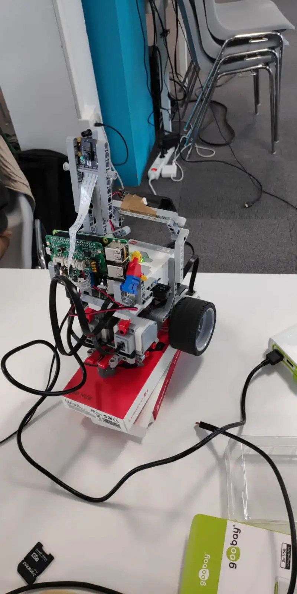
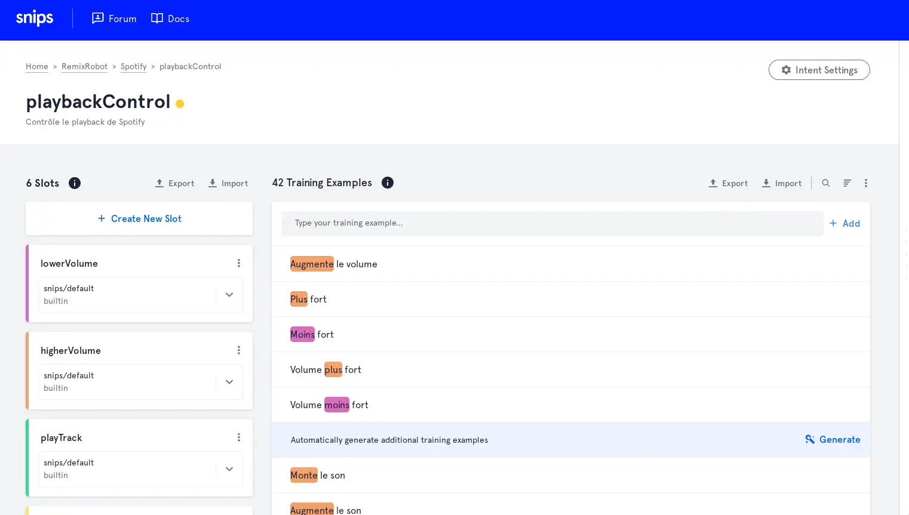

+++
title = "Découverte de Snips (fhacktory: RemixRobot)"
date = 2018-10-28
+++

# Contenu archivé

Cet article a été écrit il y a des années (`2018-10-28`). Depuis, Snips a été racheté par Sonos (un fabricant d'enceintes) et la plateforme a été fermée. 😠.

Il vous est donc impossible de suivre ce tuto mais aujourd'hui, d'autres assistants vocaux offrant les mêmes garanties existent, utilisables notamment via [HomeAssistant](https://www.home-assistant.io/). Si vous voulez découvrir cet univers, je vous conseille [cette vidéo de NetworkChuck](https://www.youtube.com/watch?v=k02P5nghmfs) (en anglais) en intro, sympathique à regarder quel que soit votre niveau technique.

---

J'ai participé il y a quelques semaines au *fhacktory*, un petit évènement très sympathique organisé par mes anciens collègues de chez [Rtone](https://rtone.fr/), à Lyon. Le principe, former des équipes avec les autres participants, laisser les organisateurs nous noyer dans une marée de Legos, objets connectés, Rapsberry Pis et gadgets en tout genre, avec pour objectif de trouver une idée de projet et de l'exécuter en 24h non-stop.

Pour cette édition, nous nous sommes lancés avec Ewen et Pascal dans RemixRobot. Il s'agit d'un petit robot Lego Mindstorm, équipé d'une Raspberry Pi et avec un support improvisé pour sa caméra, qui suit la personne la plus proche dans son champ de vision, tout en lui jouant sa musique favorite. La personne en question peut donner des ordres vocaux à RemixRobot ("couché", "suis-moi", "joue la chanson suivante/précédente", "pause/play"...).

Avant de se plonger dans le détail de la chose, voilà à quoi ressemble le résultat final:

On a aussi filmé le résultat final (robot qui joue de la musique, comprend les ordres via Snips, et suit la personne devant lui), malheureusement je n'ai pas la vidéo ☹️.

Je me suis personnellement plus concentré sur la partie commande vocale avec Snips. Et, avantage décisif à mon humble avis, le traitement de vos ordres vocaux se fait exclusivement en local! Pas besoin d'envoyer à Amazon ou Google ou quiconque la moindre demande faite à leur assistant connecté, pas besoin d'avoir confiance dans le fait que les flux audio captés ne sont pas analysés, ni à se préoccuper de l'utilisation de vos données, etc. Votre assistant personnel, complètement décentralisé, et pas besoin d'Internet pour l'utiliser. Et cerise sur le gâteau, Snips est distribué sous license GNU GPL v3.

Snips suit globalement la logique suivante: il faut tout d'abord installer la plateforme Snips sur votre Raspberry (ou autre), puis utiliser la [web console](https://console.snips.ai/login) pour créer votre propre "application". A partir de là, il faut déclarer des "intents", des cas d'utilisation de votre application. Dans notre cas nous avions un intent "playbackControl" et "motorFunctions" pour nos deux grandes fonctions, gérer le playback (suivant, précédent, pause, play...) et l'activation/désactivation des mouvements du robot. Dans chaque intent, il est possible de déclarer des "slots", à savoir des sens précis de requêtes (lowerVolume, higherVolume pour l'intent playbackControl par exemple).

Et maintenant, il n'y a plus qu'à fournir un maximum d'exemples de phrases probables, en indiquant l'intent à comprendre, et associer certains mots à un slot précis ("Joue plus fort" doit entraîner l'intent playbackControl, et "plus fort" doit être associé au slot higherVolume).

Et une fois ce processus un peu fastidieux terminé, c'est magique: on entraîne cet assistant vocal customisé par l'appui d'un simple bouton, et une simple commande lui permet d'être déployé: `sam install assistant -i proj_XXX`. Il sera capable de comprendre les phrases entrées, mais également des variations, le but étant de comprendre le language naturel de l'utilisateur.

Nous avons donc à présent notre assistant Snips, qui écoute l'entrée micro, se réveille quand il entend "Hey Snips" et interprète ensuite ce qu'il entend en un intent et un slot. Pour y associer les actions discutées précédemment, la solution choisie est de simplement se connecter au mqtt que Snips démarre, traiter chaque message et y associer une action. Ces actions sont des appels à la web API de Spotify pour gérer la musique.

Pour le reste, mes collègues seraient plus à même de décrire précisément ce qui a été fait, mais globalement [EV3 Python](https://sites.google.com/site/ev3python/) a été installé pour pouvoir communiquer avec les moteurs du Lego Mindstorm en Python. La vision était quant à elle gérée via OpenCV sur la Raspberry, qui traite ces infos et envoie des ordres aux moteurs. Dernière pièce du puzzle, un serveur écoutait les ordres venant de mon script Snips (une requête lui est envoyée quand l'ordre est "suis-moi" ou "couché"), et suspend/reprend l'envoi des ordres aux moteurs.

Tout le code est disponible sur [ce repo](https://github.com/3wnbr1/Remix-Robot), si vous souhaitez y jeter un oeil.

En conclusion, cette édition a été très fun, nous nous sommes beaucoup amusés et RemixRobot est largement à la hauteur de nos espérances! Et surtout, j'ai pu repartir avec un petit kit Snips :) merci aux organisateurs et à la prochaine!

