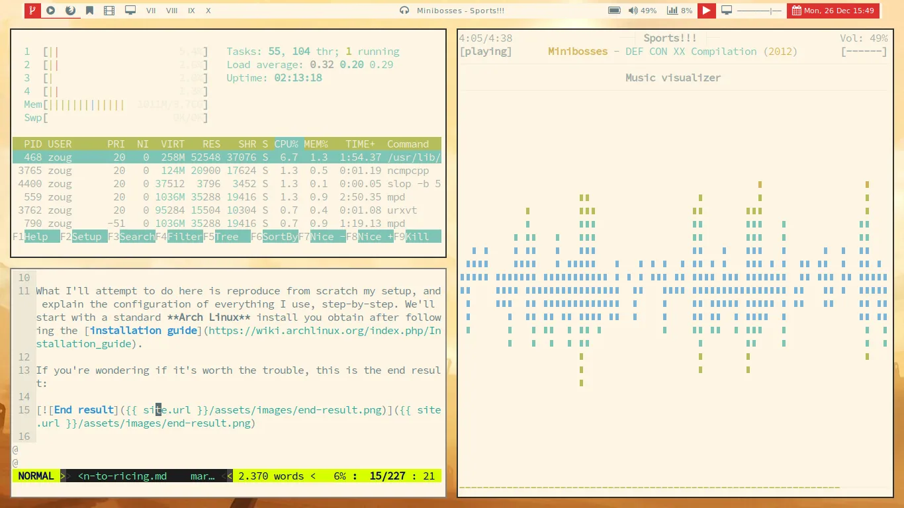
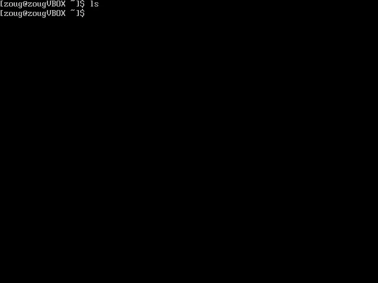
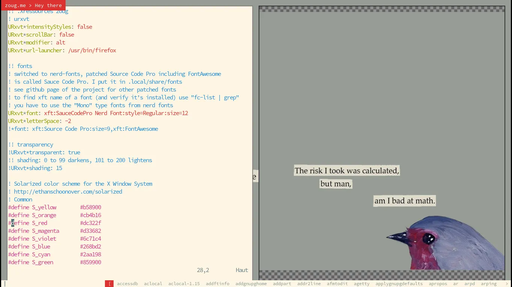

+++
title = "Introduction to the world of ricing"
date = 2016-12-20
[extra]
archive = """
This article was written years ago (`2016-12-20`). My dotfiles, which serve as the basis for this setup, have greatly changed, as you'll see if you go to [the GitHub repo](https://github.com/yzoug/dotfiles). I now use Wayland instead of Xorg, `sway` instead of `bspwm` as my window manager, and many other changes. 

Some packages I install with the AUR are now available in the repos (like the Source Code Pro nerd font, `ttf-sourcecodepro-nerd`), and the article is outdated on some things. It's an interesting read nonetheless.

A note on the word *ricing* used here. This article was [shared on Reddit](https://www.reddit.com/r/linux/comments/5ke33n/introduction_to_the_world_of_ricing/) and /u/Nwallins informed me that the roots of the term are very negative (read [his or her comment here](https://www.reddit.com/r/linux/comments/5ke33n/comment/dbnus7p/)). I wouldn't use this term today, however for the sake of authenticity I kept the article as-is.
"""
toc = true
toc_sidebar = true
+++

Generally Linux users like to configure their setup to feel and look like they want it to, and you won't spend long in the community before stumbling into **ricing**, i.e. customizing what your distribution looks like. You'll find plenty of examples in places like [r/unixporn](https://www.reddit.com/r/unixporn).

What I'll attempt to do here is reproduce from scratch my setup, and explain the configuration of everything I use, step-by-step. We'll start with a standard Arch Linux install you obtain after following the [installation guide](https://wiki.archlinux.org/index.php/Installation_guide).

If you're wondering if it's worth the trouble, this is the end result:



You can use any distribution you like but if you want to follow along, grab an ISO [here](https://www.archlinux.org/download/) and follow the installation guide then come back. I'll wait.

All done? Buckle up, you're in for a long ride!



## Before getting started

We still have a couple of things to do before getting started. First, create a non-privileged user as shown [here](https://wiki.archlinux.org/index.php/Users_and_groups#User_management), then install and configure sudo as shown [here](https://wiki.archlinux.org/index.php/Sudo). You should probably also follow the [general recommandations](https://wiki.archlinux.org/index.php/General_recommendations).

Quick note: throughout this article, the `#` symbol designs a priviliged shell (you can of course use sudo instead) and the `$` symbol is for a regular one.

We'll need to build Polybar from source at some point, so you might as well install the *base-devel* group and *git* now:

```
# pacman -S base-devel git
```

Those packages will also fix problems you would have had otherwise (with your Xresources if you use *#define*, for example). Now that you have a regular user to work with, you can copy my configuration files from [GitHub](https://github.com/yzoug/dotfiles) to your home directory:

```
$ git clone https://github.com/yzoug/dotfiles.git
```

You can now copy and modify my configuration files from the yzoug-dotfiles folder to suit your needs. In the following sections of this article, I'll detail many of those files, I hence recommand you read a particular section, then read my correspondant configuration file and modify it, and finally copying that file to its proper location. You could also use links like I do in the *setup.sh* script.

Since we'll also rely a lot on scripts, you'll also have to create a folder where you'll put them all, and add that folder to your PATH environmental variable, so that they're easily accessible by you and your programs. If you choose to put your scripts in ~/bin, edit /etc/profile and add ":/home/USER/bin" at the end of the value of the PATH variable. Now if you have an executable file in your ~/bin folder, you can launch it from the terminal directly without having to use its exact location. Another variable we should define is $XDG\_CONFIG\_HOME, since software like bspwm and sxhkd use it to find/store their configurations. So this is what your /etc/profile now looks like:

```
PATH="previous/path/here:/home/USER/bin"
export PATH
XDG_CONFIG_HOME="/home/USER/.config"
export XDG_CONFIG_HOME
```

## Xorg

The very first thing we'll need is Xorg, by far the most popular display server on Linux. Xorg will handle the mouse and keyboard, and is the basic container for GUI applications, so yeah, pretty big deal.

However, Xorg alone isn't enough: we'll need a window manager at least, or a desktop environment. While a window manager only draws your windows and position them on your screen, so the bare minimum for running GUIs, a desktop environment like [GNOME](https://www.gnome.org/gnome-3/) or [KDE](https://www.kde.org/) contains a window manager, software (usually terminal emulator, file manager, music player, etc) and looks good out of the box.

But let's get back to Xorg. We'll first need to install those two packages:

```
# pacman -S xorg-server xorg-xinit
```

xorg-server contains the server itself, and xorg-xinit allows us to use `xinit` (or its front-end `startx`) to easily launch Xorg, without having to set up a display manager. We'll configure xinit to launch our window manager and a number of scripts, and this is all done in the *~/.xinitrc* shell script. Copy the sample xinitrc to your home directory:

```
# cp /etc/X11/xinit/xinitrc ~/.xinitrc
```

You can safely remove almost everything in that file since we don't want to start all those xterms and won't use Xmodmap. We'll merge our ~/.Xresources file when we'll have it configured (we'll come back to that in a moment). So for now, just make sure to keep this block since it sources some useful scripts:

```sh
if [ -d /etc/X11/xinit/xinitrc.d ] ; then
    for f in /etc/X11/xinit/xinitrc.d/?* ; do
        [ -x "$f" ] && . "$f"
    done
    unset f
fi
```

If you take a look at my configuration, you'll see that a lot of stuff is launched with X, but don't worry about that for now: we'll add lines to your .xinitrc progressively.

Now you need to install some drivers: for your graphics card, choose from the list [here](https://wiki.archlinux.org/index.php/Xorg#Driver_installation). I have Intel Graphics on my laptop so I went with the xf86-video-intel package. We'll also install xf86-input-evdev, the evdev input driver, and xf86-input-synaptics for a laptop's touchpad:

```
# pacman -S xf86-video-intel xf86-input-evdev xf86-input-synaptics
```

That's all for now, but we're not ready yet to launch Xorg: we need at the very least a window manager.

## bspwm, sxhkd

[bspwm](https://github.com/baskerville/bspwm) is a tiling window manager. Tiling WMs are quite different from the ones you're used to on Windows / Mac / most ditributions, basically they make sure your windows don't overlap and always occupy the maximum available space on your screen. They allow to "ditch the mouse" and use keyboard commands exclusively, which has undeniable haxxor leet bonus points, and they're usually lightweight and highly configurable.

Going from a stacking WM (the usual type) to a tiling WM takes some time because of their keyboard-driven nature: you'll have to remember a lot of keyboard shortcuts. However, if you do the effort, you'll probably never look back since you'll be way more efficient. If this is your first time using bspwm, you probably should watch this video:

<iframe width="560" height="315" src="https://www.youtube-nocookie.com/embed/_pA6EaUkep0" frameborder="0" allowfullscreen></iframe>

*bspwm* is 100% configured and controlled by `bspc` commands, so any hotkey daemon works flawlessly to use it. We'll use [sxhkd](https://github.com/baskerville/sxhkd) (same developer), which is also lightweight and very easy to configure.

```
# pacman -S bspwm sxhkd
```

Copy my configuration over to the appropriate location:

```
$ mkdir -p ~/.config/bspwm ~/.config/sxhkd
$ cp ~/yzoug-dotfiles/bspwmrc ~/.config/bspwm/
$ cp ~/yzoug-dotfiles/sxhkdrc ~/.config/sxhkd/
```

*bspwmrc* is a shell script file (much like ~/.xinitrc) and is hence just a list of commands that will be executed when bspwm is started. This is where you choose the name of your desktops, configure some options, etc. You'll also see that at the very beginning there is a *toggle\_panel* script that is launched (available in my bin/ folder). For now, delete the line: we'll come back and add it when *polybar* is installed and configured.

*sxhkdrc* contains keybindings like "super + e" to represent a press on the Super key (the one with the Windows logo, usually) and the 'e' key simultaneously. To know for sure the name of a key, use **xev** (you'll need the *xorg-xev* package). You should probably either heavily modify this file to delete references to custom scripts (again, in my bin folder) or packages you don't use, or you could simply download the default configuration from [here](https://github.com/baskerville/bspwm/tree/master/examples).

## First startx

Now that bspwm and sxhkd are configured, you only have to add them to your .xinitrc, they'll be launched with X. Be sure to put the exec statement at the very end of the file, and launch **in the background** any command that doesn't return (like sxhkd).

```sh
sxhkd &
exec bspwm
```

You're finally ready! Go ahead, you earned it:

```
$ startx
```

You should be welcomed by a black screen: if that's the case, you launched X successfully! If not, take a look at the [Troubleshooting](https://wiki.archlinux.org/index.php/Xorg#Troubleshooting) section of the Xorg archwiki page, google around, check the logs...

Let's try and launch a terminal. If you didn't change the shortcut, super + Enter launches urxvt, you hence first need to download the *rxvt-unicode* package (or any other terminal emulator, just don't forget to update your sxhkdrc). This is the result on my VM:


It works, but it's far from pretty! We now have to set a wallpaper, choose a colorscheme and apply it, install *polybar* and some fonts, a notification system, etc.

## Appearence and usability

### .Xresources

Let's tackle your ~/.Xresources file!

The first thing we'll do is set a colorscheme. Many are available, I use the light variant of the very popular [Solarized](http://ethanschoonover.com/solarized). Setting a colorscheme is as simple as adding the correspondant code to your Xresources ([here](https://github.com/solarized/xresources) for Solarized).

We also have to install a patched font from the [nerd-fonts](https://github.com/ryanoasis/nerd-fonts) repo. These fonts provide useful UTF-8 characters, which is great when we'll have to edit the *polybar* config file, and is necessary if you plan on using packages like [Powerline](https://github.com/powerline/powerline) for example.

Browse around and choose your favorite font from the directory, but be sure to take the Mono version. My personal favorite being Source Code Pro, patched as Sauce Code Pro:

```
$ mkdir -p ~/.local/share/fonts
# pacman -S wget
$ wget -O ~/.local/share/fonts/Sauce\ Code\ Pro\ Mono.ttf https://github.com/ryanoasis/nerd-fonts/blob/master/patched-fonts/SourceCodePro/Regular/complete/Sauce%20Code%20Pro%20Nerd%20Font%20Complete%20Mono.ttf
$ fc-cache
```

My .Xresources file sets that font and the light Solarized colorscheme, if you want to just copy it. Once your Xresources is ready, to apply the changes when X is started, add this to your .xinitrc:

```sh
xrdb -merge ~/.Xresources
```

### Feh

[Feh](https://feh.finalrewind.org/) is a very powerful and highly configurable image viewer. Be sure to take a look at the official website / wiki / man page to get a sense of what the program can do.

```
# pacman -S feh
```

If you just want to set a wallpaper, you can add this line to your .xinitrc:

```sh
feh --bg-fill "path/to/image/file.jpg"
```

If you like to switch wallpapers often (like me), I have a *fehbg* script that, when called with no arguments, chooses a random file in ~/wallpapers. You can of course change the directory by editing the script. If an argument is supplied, the script will set that file as wallpaper instead, but only if it is in ~/wallpapers.

### dmenu

You need some kind of way to launch your programs easily. Since you have none of the tools a DE usually gives you, you can use [dmenu](http://tools.suckless.org/dmenu/):

```
# pacman -S dmenu
```

You can customize the way dmenu looks by the way you call it (the commandline arguments). You'll see that I use a small script called *dmenu_run_perso*, specifying the colors, the font used, etc. If you want to use that, you'll have to install the Adobe Source Code Pro font:

```
# pacman -S adobe-source-code-pro-fonts
```

Otherwise just replace *dmenu_run_perso* by *dmenu_run*, or adapt *dmenu_run_perso*.

### Dunst

Programs like your browser or scripts you write can send you notifications through *libnotify*. Those notifications will be handled by a notification daemon that will display them on your screen. DEs usually have their own notification system so we'll have to use a standalone replacement.

[Dunst](http://www.knopwob.org/dunst/) is a very lightweight solution, and very customizable via a simple configuration file. This is what my notifications look like:


For the same result:

```
# pacman -S dunst
$ mkdir ~/.config/dunst
$ cp ~/yzoug-dotfiles/dunstrc ~/.config/dunst/
```

As always, you can of course change the configs to suit your needs. If you want to send notifications via scripts (that run in the background and perform checks, for example), simply use *notify-send*:

```
# pacman -S libnotify
$ notify-send "Hello" "World"
```

Here's a carefully orchestrated screenshot designed to show all the changes we've made up until now:



We're almost at the finish line!

### Polybar

Previously called *Lemonbuddy*, [Polybar](https://github.com/jaagr/polybar) helps you create a cool statusbar even if your bash-fu isn't top notch: it has built-in widgets (for bspwm, the volume, mpd, etc) and the configuration syntax is very simple.

For Arch, Polybar is available on the [AUR](https://wiki.archlinux.org/index.php/Arch_User_Repository). Installing a package from the AUR is (usually) very straightforward, take a look [here](https://wiki.archlinux.org/index.php/Arch_User_Repository#Installing_packages) for details. For Polybar:

```
# pacman -S --needed base-devel #if you haven't done so already
$ git clone https://aur.archlinux.org/polybar.git
```

We now have the package and are getting ready to build it. Before proceeding, verify that the *PKGBUILD* and any *.install* files don't contain anything shady: the AUR isn't as trustworthy as the default repositories. If everything's fine:

```
$ makepkg -sri
```

Polybar is now installed! As usual, either create your configs or copy mine and adapt them:

```
$ mkdir ~/.config/polybar
$ cp ~/yzoug-dotfiles/poybar ~/.config/polybar/config
```

If your terminal emulator uses the Sauce Code Pro font, you should be able to see the custom icons I chose for the desktops, the volume etc. Those are part of font-awesome, and we'll have to install the font so that the bar can display them correctly. Like above, it's an AUR package, same rules apply:

```
$ git clone https://aur.archlinux.org/font-awesome.git
$ cd font-awesome
$ makepkg -sri
```

To change the icons and see what's available, browse [their cheatsheet](http://fontawesome.io/cheatsheet/) then copy and paste the character you choose.

To launch polybar, you can use the following command:

```
$ polybar barname &
```

You can either launch the bar with a script (like my `toggle_panel`, for which I assigned a keybinding in *sxhkdrc*) or put the line in your xinitrc. *barname* is defined in the configuration, if you use mine you'll need to use "top".

## Conclusion

Congratulations! Your computer now definitely looks like it's owned by the weird D&D nerd in the basement office.

A last-minute confession: I didn't always do things the "right" way, like by not creating a package to install nerd-fonts' Source Code Pro. Please keep in mind this article is really only meant as a small guide to get you started with your own unique setup. You're now encouraged to change as much configuration as you can, tear everything up and rebuild it with different tools, etc. You should hence do the appropriate research and basically know what you're doing!

May you find much joy in the ricing world.
