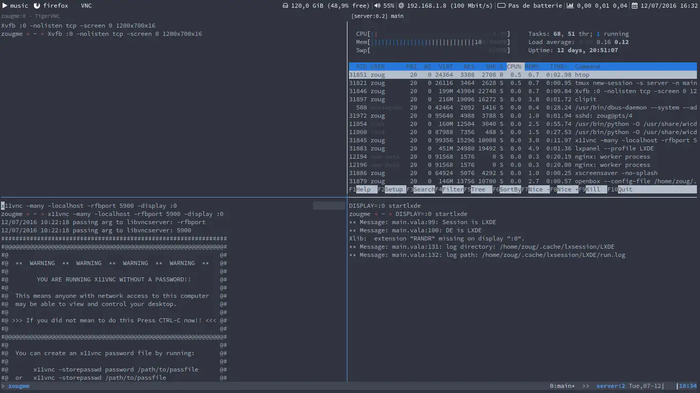
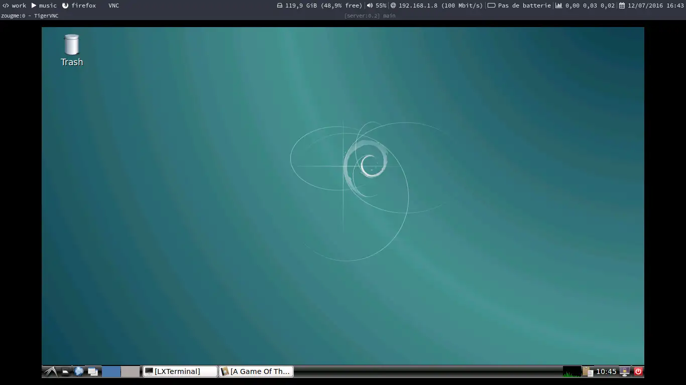

+++
title = "Secure VNC setup: full LXDE desktop on your VPS"
date = 2016-07-12
[extra]
archive = """
This article was written years ago (`2016-07-12`). The content could still be relevant today, but I'd no longer advice on doing this (with age, you don't trust the cloud/yourself as much: I don't want my private files on a server if they're not encrypted). It's a cool read nonetheless.

This article was [shared on Reddit here](https://www.reddit.com/r/selfhosted/comments/5cngl8/small_article_i_wrote_to_help_install_a_full_lxde/) back then, and people rightfully said to me that I shouldn't do this, altough, not for these reasons 🙃.
"""
+++

You can very easily setup a secure VNC connection between a cheap Virtual Private Server (VPS) and any computer you happen to have at your disposal.

I personnally find this very useful: you always have all your important files at your disposal, your favorite programs (GUI or not), your environment set-up as you like it, etc. It's like always having your personal laptop with you except you don't need it, just any computer with an Internet connection: all you need on the viewing end is an SSH client and a VNC viewer, programs you can easily have access to even without administration rights on the machine.

If you don't have a VPS, you can easily find very cheap ones at a number of cloud providers. Let's get to it!

## Installation

On your VPS, install x11vnc, Xvfb, and LXDE. For Debian-based distros:

```sh
aptitude install x11vnc Xvfb lxde
```

[Xvfb](https://www.x.org/releases/X11R7.6/doc/man/man1/Xvfb.1.xhtml) is a "fake" X server. It's designed to run headless: all operations are performed on memory and nothing is actually displayed. This is perfect in our case since we'll remote control it over SSH. [x11vnc](http://www.karlrunge.com/x11vnc/) is the VNC server we'll use.

I chose to install a full LXDE desktop environment: it's very lightweight and should run just fine even on a low-end VPS. It requires around 60 MB of RAM on my server (the [official website](http://lxde.org/lxde/) advertises 45 MB so your value may be even lower). However, if you have no need for a full DE, feel free to install only a window manager like [openbox](http://openbox.org/) or [i3](http://i3wm.org/) (tiling wm).

## Port forwarding and starting everything

In order to have a secure VNC connection, what we'll do is setup x11vnc to listen on localhost only, then forward the port 5900 through SSH. You may of course choose another port for your VNC server. Keep in mind that this setup assumes you're the only user on the VPS (or that you trust the other users that have access). Your traffic is hence encrypted through the SSH tunnel, but can be accessible by anyone connected to your machine. If that's an issue you can set a password (see the manual of x11vnc) but we won't do that here.

On your VPS:

```sh
Xvfb :0 -nolisten tcp -screen 0 1200x700x16 &
x11vnc -many -localhost -rfbport 5900 -display :0 &
DISPLAY=:0 startlxde
```

First, Xvfb:

* We're giving it the screen number :0. You can use :1 or another number if, for example, you already have another X server running on :0.

* We specify not to listen to TCP/IP connections, since we don't use them and they can be a security risk

* Finally we configure the -screen 0 to be of resolution 1200x700 and depth 16. You can of course change the resolution if you wish. The default screen 0 created by Xvfb has the dimension 1280x1240x8.

Then, x11vnc:

* With -many (or -forever), x11vnc won't exit as soon as the connection is lost with the client, so that you can easily reconnect if you have network problems.

* -localhost forces x11vnc to only listen to connections coming from localhost, so that nobody can access the VNC server from the Internet. Since we'll be forwarding the 5900 port to our machine, we'll be able to access the VNC server.

* -rfbport specifies the port x11vnc should listen to for any incoming connections.

* -display :0 is the display we're choosing, change this if you changed the Xvfb display.

Finally, we start LXDE on the display :0. We need to specify the value of the $DISPLAY variable since it's not set by Xvfb.

You can write a script to automate the process. However, if you use tmux, you can start everything up on different panes so that you can easily stop it all once you're done, along with htop to monitor easily your ressorces. To achieve this, you can use this script:

```bash
#!/bin/bash

tmux new-session -s server -n main -d
tmux send-keys -t server "Xvfb :0 -nolisten tcp -screen 0 1200x700x16" C-m
tmux split-window -v -p 50 -t server
tmux send-keys -t server:0.1 "x11vnc -many -localhost -rfbport 5900 -display :0" C-m
tmux split-window -h -p 50 -t server
tmux send-keys -t server:0.2 "DISPLAY=:0 startlxde" C-m
tmux select-pane -t server:0.0
tmux split-window -h -p 50 -t server
tmux send-keys -t server:0.1 "htop" C-m
tmux attach -t server
```

This is the result:



We're basically done! You just need to set-up the SSH tunnel between your machine and the VPS, then fire-up your VNC viewer. On your local machine:

```sh
ssh -f user@host -L 5900:localhost:5900 -N
```

Now, port 5900 on your machine is forwarded to port 5900 of your server, through the SSH connection. The -f flag tells ssh to fork into background, and the -N tells it not to execute any command.

You then connect to localhost:0 (since this is a VNC connection, :0 means port 5900, :1 port 5901, etc) with gvncviewer:

```sh
gvncviewer localhost:0
```

You can of course use any other VNC client (here, I'm using vncviewer that comes with TigerVNC). Enjoy!



