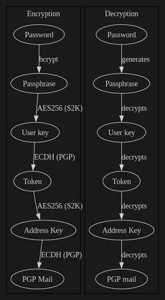

+++
title = "The world's most interesting contact form"
date = 2025-11-20
description = "Send an **end-to-end encrypted email** through a contact form, using `OpenPGPjs` to encrypt the message. We'll also code a `Rust` backend, developed using the `Axum` web framework, that will handle the email sending via SMTP."
[extra]
hot = true
toc = true
toc_sidebar = true
styles = ["form.css"]
banner = "banner.webp"
[extra.comments]
id = 115583169505969617
+++

# Contact

You can send me an **end-to-end encrypted** email by filling out this form:

{{ contact() }}

# What makes this contact form so interesting?

Okey, maybe calling it *the world's most interesting* contact form is a little overstatement.

This article will first talk about **OpenPGP**, what it is and how it works. We'll use the [**OpenPGPjs** library](https://github.com/openpgpjs/openpgpjs/), a JavaScript implementation of OpenPGP, to encrypt your message for me directly in your web browser.

We'll then code a little **Rust backend** [using **Axum**](https://docs.rs/axum/latest/axum/) to handle your message. Nothing complicated: just a route to receive the message, some input validation, and sending an email with the [**lettre** crate](https://docs.rs/lettre/latest/lettre/) using SMTP.

A message sent using this form is **end-to-end encrypted**, meaning it has been encrypted **before leaving your device** (i.e. your computer or your smartphone's web browser), then **decrypted on the final device receiving it**.

After showing you the code, we'll talk a little more about **Proton Mail**, the email provider I'm using here, what I am basing the end-to-end encryption claim on, and the privacy of email in general.

I hope you'll enjoy the article!

# Encryption on the client-side with OpenPGPjs

## OpenPGP

We all use encryption every day, to protect sensitive data in transit on the Internet. An example you're probably familiar with is **HTTPS**, which allows you to browse the Internet securely. **Pretty Good Privacy** (PGP) is an encryption software suite first developed in 1991, which the OpenPGP [standard](https://www.rfc-editor.org/rfc/rfc9580) is based on.

The way OpenPGP works is by leveraging what's called **public-key cryptography**, best explained by this simple diagram:

<figure>
{{ image(url="pub-key-crypto.svg", alt="Bob uses Alice's public key to encrypt a message, Alice uses her private key to decrypt it.") }}
<figcaption>Bob uses Alice's public key to encrypt a message, Alice uses her private key to decrypt it.</figcaption>
</figure>

To use OpenPGP, you generate what's called a **keypair**: a public and private key linked together. The public key is, as the name implies, **public**: you can widely share it, it is used to **encrypt** messages that can only be decrypted by the corresponding **private** key. And of course, you need to keep your private key **private**: anyone could decrypt messages meant for you with it.

OpenPGP is used in a variety of contexts, e.g. to *cryptographically sign* [contributions to Debian](https://wiki.debian.org/DebianKeyring). These [digital signatures](https://en.wikipedia.org/wiki/Digital_signature) are another use of public keys, but we're not getting into that here.

We'll focus on **email encryption** specifically, one of OpenPGP's most used applications. Since OpenPGP is a standard, a lot of different tools implement it (e.g. `gnupg`). In this article, we want to use the OpenPGP standard **within a web browser**, i.e. the **client-side** for users of our contact form. To do so, we need a JavaScript library (or something that can run on a web browser like [WebAssembly](https://webassembly.org/)), and here we'll use [OpenPGPjs](https://github.com/openpgpjs/openpgpjs/).

## OpenPGPjs-powered form

First, let's create our HTML form:

```html
<form id="contact_form">
  <label for="reply_to">Your valid e-mail address:</label>
  <input type="email" id="reply_to" />
  <label for="subject">Subject:</label>
  <input id="subject" />
  <label for="message">What's on your mind?</label>
  <textarea id="message"></textarea>
  <button type="submit">Submit</button>
</form>
```

This will look horrendous out-of-the-box, of course: CSS can help you make it look better (in my case, it's a skill issue).

We'll also need to include a JavaScript module, that we'll call `pgp-contact.js`:

```html
<script defer src="pgp-contact.js" type="module"></script>
```

That is where the *magic* happens. You'll find more info on the different ways to use OpenPGPjs in [their README](https://github.com/openpgpjs/openpgpjs/blob/main/README.md#getting-started), here we'll download the latest `openpgpjs.min.mjs` file and import it. Then we'll first **get the OpenPGP public key** to use for encryption, before extracting the message from the form, and **using OpenPGPjs to encrypt it**:

```js
// pgp-contact.js
import * as openpgp from './openpgp.min.mjs';

// I put my OpenPGP binary key on this path to follow the WKD standard
// more info: https://github.com/yzoug/zougfr/pull/6
const pubKeyUrl = "/.well-known/openpgpkey/hu/dj3498u4hyyarh35rkjfnghbjxug6b19";

let contact_form = document.getElementById("contact_form");
contact_form.addEventListener("submit", async event => {
  // we don't want to redirect the user after form submission
  event.preventDefault();

  // get my binary private key as Uint8Array
  const binaryPubKeyResponse = await fetch(pubKeyUrl);
  const binaryPubKeyBuffer = await binaryPubKeyResponse.arrayBuffer();
  const binaryPubKey = new Uint8Array(binaryPubKeyBuffer);

  // encrypt the message with OpenPGPjs and my PGP public key
  const pubKey = await openpgp.readKey({ binaryKey: binaryPubKey });
  const decryptedMessage = document.getElementById('message').value;
  const pgpMessage = await openpgp.createMessage(
        { text: decryptedMessage }
  );
  const encryptedMessage = await openpgp.encrypt({
    message: pgpMessage,
    encryptionKeys: pubKey,
  });
  console.log(encryptedMessage);
});
```

After submitting the form, the encrypted message is displayed in our web browser's console:


```
-----BEGIN PGP MESSAGE-----

wV4DF3pgcgpEwCMSAQdAqpyykstftEs2KlH8UlPCaG7bf6vLNOnHKFoDBVHT
[...]
-----END PGP MESSAGE-----
```


This is the final message we want to send, encrypted using my public key. It's impossible to decipher except with access to the corresponding private key, or by breaking the encryption somehow which is **not considered possible** as of today.

# Message handling on the server-side with Axum

We now have the browser part of the problem resolved: we can get a user message from a form, and encrypt it with a supplied OpenPGP public key. We now need to **send this message as an email**, to my email address.

We'll use **Axum**, one of the current [Are We Web Yet?](https://www.arewewebyet.org/) recommended web frameworks for Rust, to handle this on the server-side. We'll also use [lettre](https://docs.rs/lettre/latest/lettre/), a crate for sending emails through SMTP, along with [serde](https://serde.rs/) to serialize and deserialize data. Doing:

```cmd
cargo new axum-backend
cargo add axum
cargo add tokio -F full
cargo add lettre
cargo add serde
```

...leaves us with an initialized Rust project and the dependencies added. We'll then go from [Axum's quickstart snippet](https://docs.rs/axum/latest/axum/) and adapt it to our needs, namely:

* Creating a POST route to receive the PGP-encrypted message from the contact form
* Doing some input validation
* Sending the PGP-encrypted message through SMTP to my email address

```rust
// src/main.rs
use axum::Json;
use axum::{Router, http::StatusCode, routing::post};
use lettre::message::{Message, header::ContentType};
use lettre::transport::smtp::authentication::Credentials;
use lettre::{SmtpTransport, Transport};
use serde::Deserialize;

#[derive(Deserialize)]
struct Submission {
    reply_to: String,
    pgp_message: String,
}

#[tokio::main]
async fn main() {
    // create our app router
    let app = Router::new().route("/pgp", post(post_pgp_message));

    // run our app with hyper, listening locally on port 3000
    let listener = tokio::net::TcpListener::bind("127.0.0.1:3000")
        .await
        .unwrap();
    axum::serve(listener, app).await.unwrap();
}

async fn post_pgp_message(Json(payload): Json<Submission>) -> StatusCode {
    // if the form submission is not valid,
    // send a 400 Bad Request to the client
    if !is_valid_pgp_message(&payload) {
        return StatusCode::BAD_REQUEST;
    }

    // my Proton Mail SMTP submission token and email settings
    let smtp_username = "YOUR-SMTP-USERNAME@example.com";
    let smtp_token = "YOUR-SECRET-SMTP-TOKEN";
    let from_address = format!("My server <{}>", smtp_username);
    let to_address = "Me <me@example.com>";
    let creds = Credentials::new(
        smtp_username.to_owned(),
        smtp_token.to_owned(),
    );

    // Open a remote connection to Proton Mail
    let mailer = SmtpTransport::relay("smtp.protonmail.ch")
        .unwrap()
        .credentials(creds)
        .build();

    let email = Message::builder()
        .from(from_address.parse().unwrap())
        .reply_to(payload.reply_to.parse().unwrap())
        .to(to_address.parse().unwrap())
        .subject("A message from your contact form")
        // while sending our PGP message in the body with a text/plain
        // content-type works, the modern way is through MIME
        .header(ContentType::TEXT_PLAIN)
        .body(payload.pgp_message)
        .unwrap();

    match mailer.send(&email) {
        Ok(_) => StatusCode::OK,
        Err(_) => StatusCode::INTERNAL_SERVER_ERROR,
    }
}

fn is_valid_pgp_message(payload: &Submission) -> bool {
    // [...]
    // see the Github repo for the complete source code:
    // https://github.com/yzoug/world-most-interesting-contact-form
    true
}
```

We can now replace the `console.log` in our JavaScript above with actually sending the request:

```js
// our Rust backend endpoint
const formSubmissionUrl = "http://127.0.0.1:3000/pgp";

// send the data to our Rust backend as JSON
const dataJson = JSON.stringify({
  reply_to: document.getElementById('reply_to').value,
  pgp_message: encrypted,
});
await fetch(formSubmissionUrl, {
  method: "POST",
  headers: {
    'Content-Type': 'application/json',
  },
  body: dataJson,
});
console.log("Email sent!");
```

🎉 **Everything is now pieced together!** 🎉

When submitting the form, I receive:

<figure>
{{ image(url="e2ee-email.webp", alt="End-to-end encrypted email accessed through Proton Mail's web UI.") }}
<figcaption>End-to-end encrypted email accessed through Proton Mail's web UI.</figcaption>
</figure>

# Protecting our inbox from spam

If you put this form, as coded here, on the open Internet, your inbox will probably soon be *drowning* in spam. So the form at the top of this page is different than the code in the article, to make it a little more robust.

But worry not: the changes made are the subject of the next article, where we'll talk about the **added anti-spam code** to do email verification, and **Traefik + CrowdSec**, two additionnal pieces of software I'm using for hardening.

**Subscribe to my [RSS feed](/rss.xml) and/or follow me [on Mastodon](https://infosec.exchange/@zoug) if you don't want to miss it!**

In the meantime, you can already check out the final version of the code, including what's not covered yet in this blog post: I've put everything in [this GitHub repo](https://github.com/yzoug/world-most-interesting-contact-form). I've also included what's needed to create a Docker image from the Rust backend binary, and an example Docker Compose file to deploy everything.

⭐ **Want to make my day? You can [star the repo on GitHub!](https://github.com/yzoug/world-most-interesting-contact-form)** ⭐

# Proton Mail and encrypted communications

To use OpenPGP, you'd usually generate a keypair with something like `gnupg`, and that's the public key you'd share with your correspondants for private communication. **This is not what I'm doing here**: because I use Proton Mail, and because their whole ecosystem is built around PGP encryption, **they** manage the keypair for me.

In a nutshell, they actually **do not have access to my private key**: it is generated on my computer, **encrypted** using a key derived from my password, before being sent to them. Likewise when I look at my emails, **my device**, not their servers, decrypts the private key using my password.

They make heavy use of OpenPGPjs, the same library we used here, to handle decrypting your emails and data. You can also look at their code: a lot of Proton Mail is open source, e.g. [their web clients](https://github.com/ProtonMail/WebClients). An independent audit report, albeit a little old, is [also available](https://proton.me/community/open-source).

Moreover, Proton Mail [implements SRP](https://proton.me/blog/encrypted-email-authentication). This makes it possible to **authenticate without sending your password** to the server. You can verify this easily by looking at your network traffic when making a login request:

<figure>
{{ image(url="protonmail-srp.webp", alt="Request sent by my browser when logging-in to Proton Mail") }}
<figcaption>Request sent by my browser when logging-in to Proton Mail.</figcaption>
</figure>

This is how you can use the Proton Mail website much like you would use Gmail, while allowing them to keep their end-to-end encryption promise. This is also why, when resetting your account password, you [can't access your data](https://proton.me/support/recover-encrypted-messages-files) without some way of restoring it.

> [!TIP]
> I went down a little rabbit hole trying to understand the flow of account creation, using breakpoints in my browser's debugger and searching through the Proton Mail codebase linked above. I initially wanted to do deeper technical dive into all this in another article, but I stumbled into [this one](https://afarah.info/public/blog/verify/proton/index.html) by searching GitHub, which does it better than I could!
>
> Since it's public domain, I'll reproduce one of the diagrams here, which explains what gets generated and how it's encrypted before being sent to Proton Mail, and the same flow for decryption:
>
> 
>
> If you want to understand how Proton Mail handles your password and private keys every step of the way, be sure to [check it out](https://afarah.info/public/blog/verify/proton/index.html).

Of course with email, you always have to put **some** kind of trust in your provider. Me personally, I'd rather trust Proton Mail than Google or Microsoft, for the simple reason that Proton Mail's business model is **making money from subscriptions**, while Google, Microsoft and the rest of the tech giants' business model is, at least partly, **making money from their users' data**.

Almost 100% of the emails I send and receive are **not** end-to-end encrypted. So Proton Mail could technically store a decrypted copy of my emails somewhere, either:

1. when I receive them, **before encrypting them** for storage in my inbox
2. when I send an email **without PGP encryption**, so to pretty much everyone

Also, [your email's metadata](https://www.privacyguides.org/en/basics/email-security/#email-metadata-overview) (i.e. the fact that you sent an email to `someone@example.com` at 2:33pm last Saturday) is never safe, even with end-to-end encryption: you have to trust your provider with it. This is what you get when a protocol [first created in 1982](https://www.rfc-editor.org/rfc/rfc821) is still widely used today.

Yet another way for Proton Mail (or whoever makes them) to access my emails, **even those end-to-end encrypted**, is changing the JavaScript served by their web UI. While this wouldn't go unnoticed very long if done on a large scale, it's impossible for me, as an end user, to verify this every time I use the web app.

One thing's for sure: using OpenPGP and end-to-end encryption more widely can't hurt. Nowadays, some people implement [WKD](https://wiki.gnupg.org/WKD) (I know `zoug.fr` [does](https://github.com/yzoug/zougfr/pull/6) 😉), which allows email clients to automatically fetch the OpenPGP public key belonging to a given email address. In fact, you [don't even need to serve any file yourself](https://keys.openpgp.org/about/usage/#wkd-as-a-service) to set it up for your domain.

Proton Mail implements WKD [since 2019](https://proton.me/blog/security-updates-2019) and if your domain also does, their users will send you encrypted emails automatically. This is great, because a lot of the problems with OpenPGP revolve around the fact it's hard to use: this helps making it easier to work with.

Now, I've been a happy user of Proton Mail for almost twelve yers: I created my account during their first public beta, in 2014. In fact I still have a `@protonmail.ch` address (they stop issuing those years ago), and here's a very, very old screenshot I found in my backups:

<figure>
{{ image(url="protonmail-2016.webp", alt="Screenshot of the Proton Mail webapp from March 2016") }}
<figcaption>Screenshot of the Proton Mail webapp from March 2016.</figcaption>
</figure>

However, Proton's CEO Andy Yen did recently cause a little Reddit "firestorm", that made some people believe he's pro-Trump. The orange toddler and his ideas are everything I stand against, so this damn near missed convincing me to switch to [Mailbox.org](https://mailbox.org/) (also built around OpenPGP, and way cheaper than the premium Proton Mail plan, but no free plan).

When looking into what was actually tweeted, it is more nuanced: [this news article](https://techissuestoday.com/proton-ceo-responds-to-backlash-after-his-post-supporting-trump-selection/) does a good job summarizing what happened. Privacy-wise, I feel like Proton Mail has been doing everything right, so I recommend their services. Policy-wise, when your competition's Google, the bar is [very, very low](https://www.404media.co/google-has-chosen-a-side-in-trumps-mass-deportation-effort/).

In any case, while I've talked about Proton Mail here, you're absolutely not forced to use them for end-to-end encrypted email, nor even any secure email provider: that's the beauty of it, your email's contents are unreadable from anyone except your email's recipient, provided they use OpenPGP (the hard part), and provided you don't care about the metadata (you should). You can reproduce the setup described here with **any email provider**, if your email **client** supports OpenPGP (like [Thunderbird](https://support.mozilla.org/en-US/kb/openpgp-thunderbird-howto-and-faq)).

## Chat Control

I can't end this article without at least mentioning **Chat Control**, since it's still very much alive at the time I'm writing it.

Chat Control is a very dangerous European Union law proposal that was defeated around a month ago, or so we thought, because it is now back ["through the back door"](https://www.patrick-breyer.de/en/chat-control-2-0-through-the-back-door-breyer-warns-the-eu-is-playing-us-for-fools-now-theyre-scanning-our-texts-and-banning-teens/).

Especially if you live in Europe, **make sure to send an email** to your representatives (in your native language). Since you're here, you probably care about these issues (few do): the [fightchatcontrol.eu](https://fightchatcontrol.eu/) website has everything you need to help you make your voice heard, and if even you don't do it, no-one will 😉.

If you made it this far, be sure to let me know and share any thoughts using... the contact form above, of course! You can also leave a comment below.
